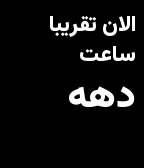
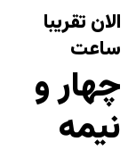
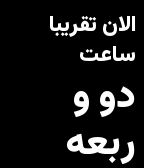
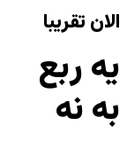

# Farsi Fuzzy Watchface

A stunning, native Farsi fuzzy time watchface for Pebble smartwatches, written from the ground up for maximum visual impact and cultural authenticity.

## Features

- **Calligraphic Typography:** Custom-built using the `Vazirmatn-Black` font with dual-size rendering for a premium, editorial look on your wrist.
- **Conversational Farsi:** Reads the time exactly how Farsi speakers naturally say it — "الان تقریبا ساعت ده و ربعه" — with colloquial phrasing and suffixes.
- **Multiple Accuracies:** Choose between 15-minute intervals, 30-minute intervals, exact hours, or even loose daily periods ("صبحه").
- **Smart Auto-Wrapping:** Longer phrases automatically flow across multiple lines, keeping everything within the screen.
- **Anti-Aliasing:** Harnesses Pebble's hardware and a custom grayscale layout generator to create silky smooth curves—a rarity on Pebble's 1-bit or 2-bit color space!
- **Theme Toggle:** Instantly switch between **Dark Mode** (White on Black) and **Light Mode** (Black on White) directly from the Pebble app configuration page! No memory overhead.

## Screenshots

<div style="display: flex; gap: 10px;">
  
  
  
  
</div>

## Changelog

### v3.0.0
- **Redesign:** Complete typography overhaul with dual-size font rendering — small prefix ("الان تقریبا ساعت") and large bold time ("ده و ربعه").
- **Enhancement:** Updated all 57 phrases to use natural, conversational Farsi phrasing with colloquial suffixes (e.g., "ده‌ه", "نیمه", "ربعه").
- **Enhancement:** Smart auto-wrapping engine automatically flows long phrases across multiple lines.

### v2.8.0
- **Feature:** Full Light/Dark theme toggle in Pebble Config app.
- **Enhancement:** Watchface utilizes native Pebble palette manipulation for instant theme switching with 0% memory overhead.
- **Bugfix:** Resolved `TUPLE_INT32` memory alignment issues from PebbleKit JS payload.
- **Bugfix:** Pebble configuration page now securely caches settings via `localStorage`.

### v2.6.0
- **Redesign:** Transitioned to heavy, calligraphic typography (Vazirmatn-Black).
- **Enhancement:** Introduced a custom Python cluster-layout algorithm to securely overlap and interlock Farsi words, creating a beautiful piece of art.
- **Enhancement:** Enabled anti-aliasing via grayscale output to significantly improve jagged edges.

### v1.0.0
- Initial release using standard layout and fonts.

## Installation

Download the latest `app.pbw` from the [Releases](https://github.com/MakeAwesomeHappen/farsi_fuzzy_watchface/releases) page and sideload it to your phone using the Rebble App.

## Building from source

1. Run the Python generation script to create the 57 unique time states:
   ```bash
   python3 generate_bitmaps.py
   ```
2. Build the PBW using the Pebble SDK:
   ```bash
   docker run --rm -v "$(pwd):/app" -w /app rebble/pebble-sdk pebble build
   ```
